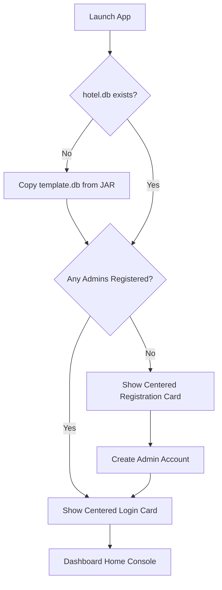

# Grand Azure — Property Management System (PMS)

[](https://oracle.com/java/)
[](https://sqlite.org/)
[](#)
[](#)

An enterprise-grade, zero-configuration desktop **Hotel Property Management System (PMS)** written in pure Java Swing and backed by SQLite. Grand Azure delivers a luxury, high-performance visual dashboard experience tailored for property operations, room inventory management, front-desk bookings, payment ledgers, and real-time business analytics.

---

## 🔑 Key Features

| Feature | Description |
|:---|:---|
| **Maximized Default View** | Application starts maximized for an immersive, dedicated console experience. |
| **Responsive Grid Layout** | KPI grids, charts, toolbars, and forms dynamically adapt to any screen resolution from $1366\times 768$ to $2560\times 1440$. |
| **Centered Auth Card** | Login and Registration screens float inside a centered, fixed-dimension authentication card to prevent layout stretching on wide displays. |
| **Zero-Configuration DB** | SQLite embedded engine runs out-of-the-box with **Write-Ahead Logging (WAL)** and automated file locking retries. |
| **Real-time Password Shield** | Dynamic validation of security requirements (length, uppercase, lowercase, numbers, special characters) with a live strength progress bar. |
| **First-Launch Guard** | Automatically provisions tables from a clean template database and displays the "Create Administrator Account" registration flow if zero admins exist. |

---

## 🛠️ Technology Stack

| Component | Technology | Detail |
|:---|:---|:---|
| **Core Runtime** | Java SE 17 | JDK 17 standard API classes only. No Maven/Gradle dependencies. |
| **GUI Framework** | Java Swing & AWT | Custom double-buffered paint panels, vector drawing, and `CardLayout` fade animations. |
| **Database Engine** | SQLite JDBC | `sqlite-jdbc-3.42.0.0` (slf4j-free version) running with WAL mode enabled. |
| **Branding / Styling** | Custom CSS-like Tokens | Pre-configured color palettes (`Theme.java`) and layouts (`UiLayout.java`). |

---

## 📁 Repository Structure

```
Hotel_Reservation_System/
├── src/
│   ├── main/
│   │   ├── java/            # Source code classes (ui, service, dao, database, model)
│   │   └── resources/       # Configuration properties and empty SQLite template db
├── lib/
│   └── sqlite-jdbc-3.42.0.0.jar # Database driver dependency
├── build.bat                # Clean compiler and fat JAR packager script
├── README.md                # Project documentation and guidelines
└── hotel_system.jar         # Standalone compiled executable fat JAR
```

---

## 🏛️ Application Architecture & DB Isolation

### SQLite WAL Connection Model
To support responsive UI painting alongside asynchronous `SwingWorker` threads, database transactions are routed to a dynamic pool using a SQLite connection URL pointing to the user profile folder:
```
jdbc:sqlite:%USERPROFILE%/.HotelReservationSystem/hotel.db?journal_mode=WAL&busy_timeout=5000
```
This isolates the database on the user's local PC, enabling multi-user data segregation. If the database file is not present on launch, it is programmatically generated by copying the clean, empty resource schema (`template.db`) from inside the classpath.

### Dynamic Login & Registration Flow


---

## 📸 Real Application Screenshots
*Note: Because our AI build sandbox runs in a headless environment, visual screenshots could not be captured automatically. Developers running the application on a desktop environment can capture and save real screenshots to the `docs/images/` directory in the repository to display them in this section.*

### 1. Login Page
*Centered login card on full screen.*
<!-- TODO: Capture a real screenshot of the login screen and save it as docs/images/login_screen.jpg to render here -->

### 2. Create Administrator Account
*Multi-column input registration flow with live password validation.*
<!-- TODO: Capture a real screenshot of the admin registration screen and save it as docs/images/register_screen.jpg to render here -->

### 3. Dashboard Console
*12 KPI metrics cards, occupancy trends, line charts, and active stays.*
<!-- TODO: Capture a real screenshot of the dashboard console and save it as docs/images/dashboard_screen.jpg to render here -->

### 4. Room Inventory
*Housekeeping statuses and category grids.*
<!-- TODO: Capture a real screenshot of the room inventory screen and save it as docs/images/rooms_screen.jpg to render here -->

### 5. Customers Profiles
*VIP thresholds and visitor archives.*
<!-- TODO: Capture a real screenshot of the customer profiles screen and save it as docs/images/customers_screen.jpg to render here -->

### 6. Bookings Front Desk
*Reservations check-in, check-out, and print invoice actions.*
<!-- TODO: Capture a real screenshot of the bookings screen and save it as docs/images/bookings_screen.jpg to render here -->

---

## 🚀 Installation & Launch Guide

### Requirements
* **Operating System**: Windows PC
* **Java Runtime**: JDK 17 or JRE 17+ installed and set in your `PATH`

### How to Build
Run the build script from the project root in Command Prompt or PowerShell:
```cmd
build.bat
```
This script cleans the directories, compiles all Java files against the SQLite classpath, extracts driver natives, and packs the standalone fat JAR `hotel_system.jar`.

### How to Run
Double-click **`hotel_system.jar`** or execute it from the command line:
```cmd
java -jar hotel_system.jar
```

---

## 🔒 Security Features
* **Password Hashing**: Utilizes PBKDF2/SHA-256 with dynamic per-user salt generators to secure passwords.
* **Prepared SQL Bindings**: All queries bind parameters explicitly via `PreparedStatement` to block SQL injection risks.

---

## 👨‍💻 Developer Information
* **GitHub**: [@ANIKETH915](https://github.com/ANIKETH915)
* **Project Role**: Lead Developer / Senior Swing Architect
